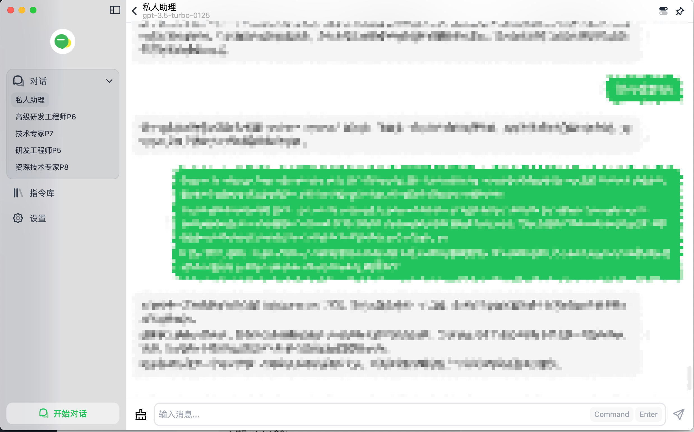
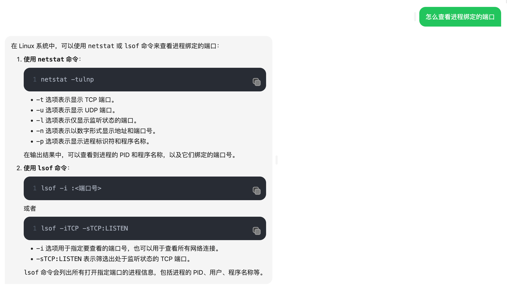

在AI的使用上我大概还是慢半拍。第一次比较深刻感知到大模型这块的发展是在23春节过后一次聚会上，此时距离ChatGPT发布刚过去几个月， 几个大佬已经开始谈及这块的进展，我呢听的津津有味，但事后我并没继续关注， 现在，他们搞的有一些已经是非常有名的开源大模型了。 

读研究生的时候，旁边几个课题组也在做的图像生成，随手一画便可以生成风格画，效果震撼，但是当时总感觉离实际应用还差的很远。 工作多年后，对于AIGC的认知还是上学时的固有印象， 没想到但整个社区普及发展的速度如此之快，我还是后知后觉了。 现在想想，相比于CV的应用和普及，NLP的突破我觉得才是AIGC这个领域焕发的更重要的催化剂。  

ChatGPT在自然语言的处理上展现出了非常强大的能力， 无论是语义的理解还是逻辑推理等能力，基本接近了人类的能力。 加上大力出奇迹，模型的参数量不断丰富着GPT的知识库，这比人脑的记忆力和检索力强多了。 当人机交互不再是瓶颈的时候，机器便可以充分满足人的信息诉求， 真的感慨啊， 人工智障不再智障。

直到23年中，ChatGPT的应用如雨后春笋，我开始有些慌，是真的,  有一种快要被时代抛弃的感觉。 我开始尝试来使用，然后便用到了现在。 给大家看看我和ChatGPT的对话页，我讲不同Prompt、GPT模型版本做了简单的划分，更追求精确度的我使用P8,  简单的问题回答就让P6来做好了 ~ 颇有还混迹在大厂的味道(非讽刺)。  客户端我选择的是BotGem，我追求的是一个简单高效的交互页面，这个前端App足够满足。

下面聊聊我和GPT主要协作的几个场景， 以及举一些我以往和GPT的聊天记录中找到一些代表性的例子。

###  1、异常问题排查
以往遇到一些报错或者异常，第一时间都是先去Google，排名靠前的大概率在Stackoverflow都可以找到答案，后者就是一些博客。 尽管这些也解决了大部分问题， 还是存在一些痛点

- 母语的习惯， 通过google搜索的解决方案多数是英文的， 不免要花费较长的时间来理解
- 解决方案零散， 通常是需要查看多个帖子才能形成一个有效的解决方案
- 检索到的重复内容多，掺杂着大量无效的帖子

上述问题，我现在只要通过合理的Prompt，直接把问题丢给ChatGPT， 90%以上我都可以获得一篇完整的解决方案。而且还可以引申出更多的关联问题以及解答。  所以，目前遇到问题，我第一时间想到的已经不是Google了。 这种习惯的转变，我觉得是有效价值的自然引导，而绝非ChatGPT的推广能够迫使我形成的。

### 2、一些基本命令的使用手册
一些简单的运维手册，平常在Linux下一些系统命令，用过一段时间就忘掉， 年龄大了记性确实越来越差劲😄。 
偶尔会需要用到一些命令，网上直接现查现用， 不过大多数还都是罗列这个命令一堆命令用法，针对性差，我还是需要仔细看。 但是GPT可以针对性的仅输出要用的内容，并给出示例解释，这很棒！

### 3、新知识的获取
这部分我主要指的是领域知识的获取，举个例子，我近些年主要集中在Yarn、K8S等资源调度领域，最近开始接触Spark计算框架，阅读源码的时候，近乎抓狂😄， 光是看Scala相关的语法就费了不少劲。 ChatGPT给了我大量的帮助，在自动分析代码这块我是非常满意的，可以给出给定code的含义、语法示意等，大大加快了我分析源码的速度。

还有很多其他领域的知识我基本都是询问GPT，有时候会让它直接给出一套大纲，我来基于这套大纲来有方向性的查询，更加针对性、系统性的获取知识。

目前也有非常多的使用AI协助编程的插件，真的推荐大家多用用。

# 总结
GPT确实带来了一场信息革命，一次人机交互的跨越式变革，坚信未来AI一定会给我们的生活带来更多的便利， 成为一个真实的虚拟助理。