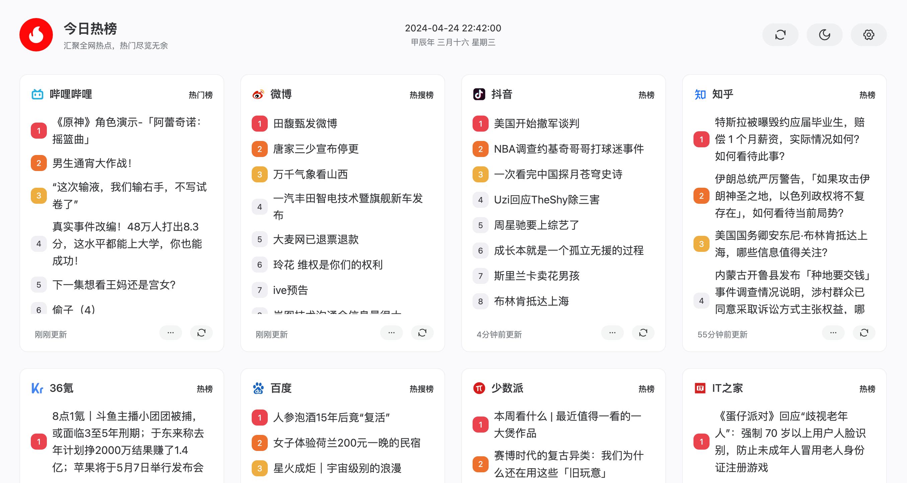
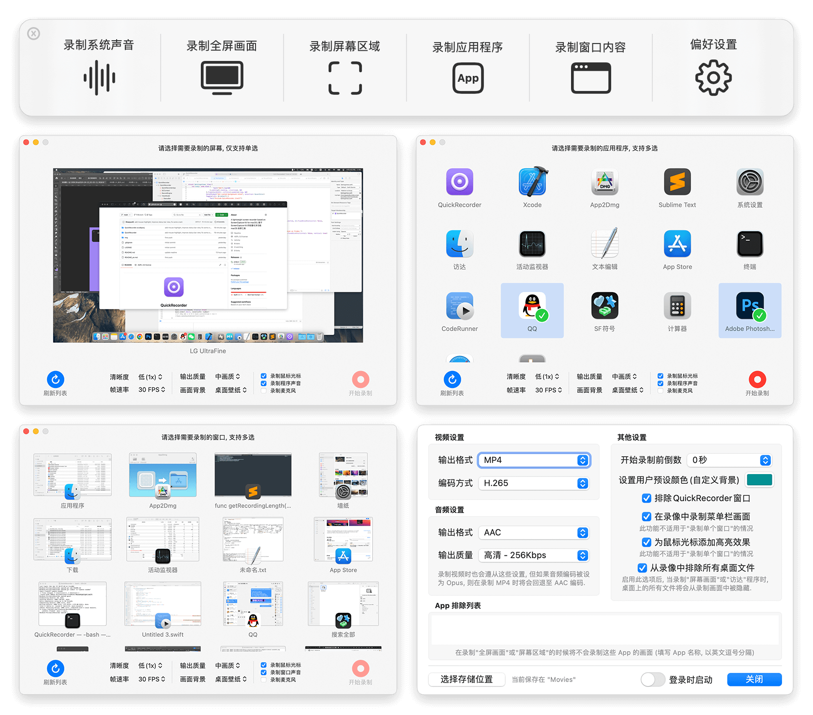
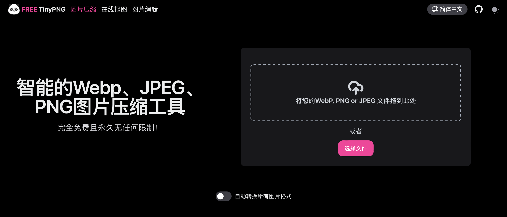

分享几个最近看到的项目， 闲暇之余增添一些新鲜感和乐趣。
#  ServiceLogos

项目地址：https://github.com/SAWARATSUKI/ServiceLogos

该项目为C++ 、Java 、Github  vim等常见编程语言/工具/站点 设计了一系列的主题风格logo， 发布不到1天，start数已经破千。目前仅提供了50个左右的logo，不过从Issue上看，大家已经给作业布置了2000多个设计的作业了~

个人用途不做限制，你可以用这些logo打印一些创意贴纸等小物件 不过这些logo并不可以用作商业或者盈利项目，作者保留著作权
 
#  今日热榜API🔥

一个聚合热门数据的API接口，灵感来自RSSHub， 这么看万物皆可聚合， 摸鱼必备😄

这个项目分为两个， API和一个前端项目， 支持docker部署或者Vercel部署。
- https://github.com/imsyy/DailyHotApi
- https://github.com/imsyy/DailyHot

 

#  QuickRecoder

项目地址: https://github.com/lihaoyun6/QuickRecorder

一个多功能、轻量化、高性能的 macOS 屏幕录制工具， 非常小巧，安装包仅有4m。
- 使用 SwiftUI 编写, 体积小巧轻量化. 软件大小仅 4MB 左右, 无任何累赘功能.
- 支持窗口录制, App 录制等模式; 支持窗口声音内录, 鼠标高亮, 隐藏桌面文件等功能.QuickRecorder 启动后直接显示主功能面板, 关闭后可以点击 Dock 栏图标再次呼出.
- 开始录制后 QuickRecorder 会在菜单栏显示录制指示器, 可随时暂停或查看录制时长.

 

#  FreeTinyPng
最近开始写博客， 涉及到图片的处理， 查了好多，发现这么一个免费的在线图片压缩工具，支持图片在线压缩、编辑、扣图等功能， 真的很不错
网站地址:  https://free.tinypng.site/

