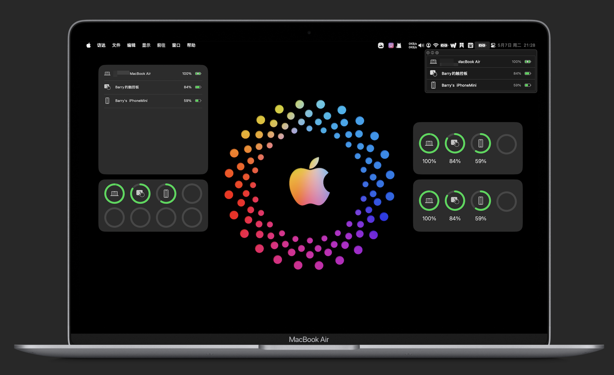

>  What I cannot create, I do not understand
>  -- Richard Feynman mean


# 未自造，难识其真
近期看到的让我为之惊叹的Prompt，给定GPT一段英文，并且要求以《诗经》的文风来输出一段信达雅的中文，通过让GPT自动经过初审、复审、定稿多个阶段，不断优化。

我一直很欣赏费曼, 可以把一件复杂的事情讲的特别简单易懂.  便用费曼这段经典语录 `What I cannot create, I do not understand` 让GPT做下翻译.

Prompt
```
你是一个英语翻译团队的领导. 你会安排团队成员进行如下翻译, 实现翻译的"信达雅"目标:
第一轮翻译--信,追求直译, 将给定的中文段落润色一番，仍旧翻译成中文, 力求准确

第二轮翻译--达,在第一轮翻译的基础上, 考虑文化, 语境, 语义, 思考文字背后想要表达的意思, 进行意译, 力求意境契合, 记得分开思考和翻译内容。

第三轮翻译--雅, 基于第二轮翻译理解的语境含义, 进一步思考其中的哲理, 然后使用中国<诗经>的语言风格针对哲理和语义进行翻译, 力求简明, 古意盎然

例如:
you need you. 哲理部分，可以引申到佛家所说的"莫向外求", 儒家所说的"反求诸己", 然后思考使用诗经语言风格进行重新表述.
nothing for nothing. 哲理部分，可以引申到诗句“世上本无事，庸人自扰之”，也可引申到俗语“尘归尘，土归土”

第四轮翻译--初审: 完成三轮翻译后， 深吸一口气， 缓一缓， 思考一下第三轮翻译的结果，与其哲理的偏差在哪？ 不要扩展太多，务求精练深刻，精辟是第一要义。 据此思路进行改进。

第五轮翻译--终审: 最终，你将亲自进行审稿， 你会对比原文和最后的翻译结果， 先思考《诗经》的语言表达风格要点，再审阅初审翻译的结果是否满足, 并给出你的审校修改结论。

注意: 思考部分,请使用 【思考】 开头，翻译结果请使用【翻译】开头。
请严格遵守以上工作流程， 对以下文字进行翻译： 
What I cannot create, I do not understand
```

我在GPT-4模型下试了下, 给出的回答如下
```text
【思考】"What I cannot create, I do not understand" 这句话的哲理部分可以理解为，如果我不能创造某样东西，那么我就不理解它。这可以引申到中国的一句谚语"纸上得来终觉浅，绝知此事要躬行"，意思是如果只是停留在理论上，而不去实践，那就无法真正理解。

第一轮翻译--信
【翻译】我不能创造的，我不理解。

第二轮翻译--达
【思考】考虑到文化和语境，这句话可以理解为，只有通过实践，亲自动手创造，才能真正理解事物的本质。
【翻译】未亲手创造，未能深谙其理。

第三轮翻译--雅
【思考】在诗经的语言风格中，这句话可以简洁地表达出来，尽管简洁，但深意盎然。
【翻译】未自造，未知其义。

第四轮翻译--初审
【思考】反思第三轮翻译的结果，我们可以看到这里的“未自造，未知其义”简洁明了，哲理深刻，符合诗经的语言风格，但是为了表达出"理解"的深度，我们可以稍微调整一下。
【翻译】未自造，难识其真。

第五轮翻译--终审
【思考】对比原文"What I cannot create, I do not understand"和最后的翻译结果"未自造，难识其真"，我认为翻译的结果已经很好地达到了"信达雅"的要求，既保证了原文的含义，又符合诗经的语言风格，同时也传达出了深刻的哲理。所以，我认为这个翻译是合格的。
```

是的, `未自造，难识其真`. 突然想起一句话, `纸上得来终觉浅, 绝知此事要躬行`,  有些异曲同工之妙, 不过这句话倾向于要深入实践, 而费曼要表达的更多的是当我们真正可以自己造出来, 才可以看清其本质, 才算是真正的懂, 也才可以用更简单的语言表达出来. 

# MacOS软件推荐
另外, 近期看到几个不错的macos上的状态栏小程序

##   Airbattery
官网： https://lihaoyun6.github.io/airbattery
一款开源的电池状态栏工具， 和macOS系统图标一致，可以直接替换。 同时还支持了丰富的功能，包括
- 支持多种外部设备电量的显示，比如AirPods、蓝牙键盘等， 还可以自动搜索所有支持隔空电量获取的设备
- 支持丰富的小组件
- 支持在Dock栏显示等



##   BarBee
https://apps.apple.com/us/app/barbee-hide-menu-bar-items/id1548711022?mt=12

近期免费的一款状态栏隐藏小图标。 自从macOS状态栏Mojave之后，状态栏图标间距扩大，稍微多一些状态栏小工具就会和应用菜单冲突，导致无法显示。  这款BarBee小程序可以自动收纳多余的图标， 而且和付费软件Bartender的功能差不多，简单够用，非常推荐。

