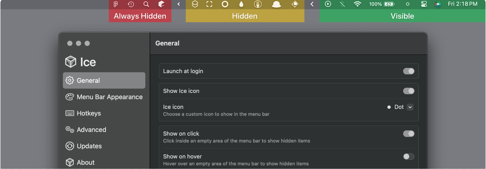
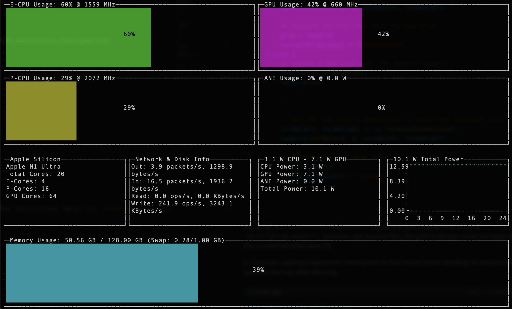
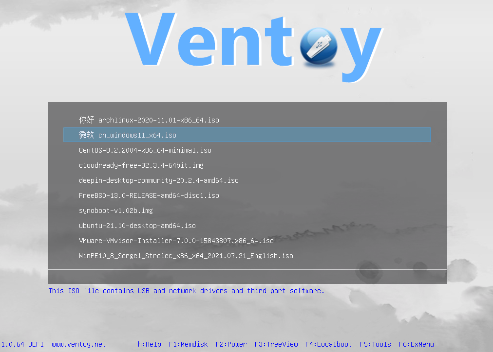

拖更快一个月了吧，一直没想好周刊到底应该以什么形式或者内容呈现，单纯的软件分享似乎太单薄。 所以后面会多一些其他方面的，比如一些好玩的项目、书籍、个人见闻、生活心得等等。 相比于社交媒体，我发现我更喜欢在博客上来分享，分享状态会更从容一些。

## 书籍
最近看到的一本书《现代CPU性能分析与优化》, 英文原书《Performance Analysis and Tuning on Modern CPU》，由Denis Bakhvalov等人编写。

https://weedge.github.io/perf-book-cn/zh/chapters/1-Introduction/1-1_Why_do_we_need_perf_analysis_cn.html 
这本书的让软件人员如何更好地理解其应用程序在现代硬件上的性能表现，以及如何可以高效的发挥现代硬件的性能。

作为多年分布式计算行业从业者，感受颇深。 即使在知名的互联网企业中，也存在着大量的低效的代码。 这些年硬件行业的快速发展把软件质量给“惯坏了”。 硬件制程的不断缩小带来的性能提高很多时候高于一些算法上的优化。我印象最深刻的是读研期间某个老师讲的，如果你的算法提升的比例只有1%~2%，那还不如换个硬件来的快。 

不过硬件性能提升的这个趋势已经开始放缓，在成本的压力下，需要软件重新出现在舞台中间，发挥算法的优势，发挥软硬件结合的优势，也由从通用处理器往专用处理器发展，避免无效的计算。下图可以看到，单线程性能增长正在放缓。单线程性能是指在隔离环境中测量时CPU核心内的单个硬件线程的性能。

## 发现
本周看到一个MacOS上的状态栏隐藏工具`Ice` , 功能上和另一款开源`HiddenBar` 差不多，项目地址 https://github.com/jordanbaird/Ice 。 

前段时间这类工具的头牌`Bartender` 还闹出风波被卖给了其他机构，由于获取较多的权限，而引起了信任危机。

另一个是MacOS上的终端监控工具`mactop` ,  不过仅支持Apple系列芯片。可以方便快捷的监控CPU、GPU的实时指标，E-Core、P-Core、功耗等。

`Ventoy` 这块工具不知道大家用过没，之前安装系统总是需要刻录U盘，每次换个系统就需要重新格式化磁盘，重新刻录。 Ventoy是可以把很多系统镜像打包到U盘中，启动的时候可以选择需要安装的系统，后面打算试试，刚入手了一台新主机，免不了折腾系统了。

## 个人
端午节前入手了一款`零刻SER8 AMD 8845HS` 版本的mini小主机，打算继续做个服务器，折腾折腾。  家里那台10年前的笔记本一直用作小服务器在跑，终于是扛不住了，发热厉害，风扇已经吹个不停，一度还想过把这本子放到洗手间凉快凉快。 而今，这个小主机个头还小，开机也没啥噪声，性能也比这老本子翻了好几番了，价格3700左右， 想想10年前的还得7000多买的笔记本，真的是感叹时代的发展。

> 我们已经被信息茧房包裹着，当你开始探索时，会发现原来自己只处于世界的一个小角落

---
🏋️ 本周体重: <mark> 78kg </mark>
