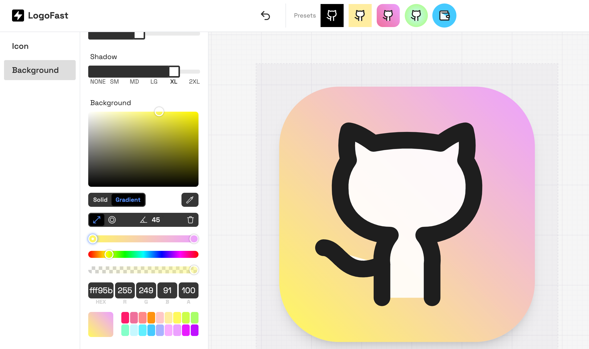

## 书籍
最近几天知乎有个帖子，讨论的是ASML在一个PPT上指出了目前的2nm, 3nm工艺并不是实际的物理是尺寸，A10也就是1nm时，对应的是18nm，A7也就是0.7nm时，应对的是18-16nm，甚至到A2，也就是0.2nm时，实际金属半间距是16-12nm。

实际上，这个所谓的秘密我也是去年看`《芯片简史》` 这本书才知道，我特地找出来了。其实目前我们说的2nm，3nm都已经是逻辑上的工艺制程表示而已。 早期是将栅长来表示，但是后面栅长变化已经没那么明显了，都将现有`节点长度*0.7`表示下一代的工艺， 业内也索性就这么沿用下来了。个人感觉这本书对于非芯片行业从业者来说还是很不错的，浅显易懂，在看历史故事的时候也队芯片的一些知识有所了解，还是推荐大家看看。

## 发现

`ShipFast` (https://shipfa.st/tools/logo-fast ) 是一个提供了很多开箱即用的网站工具，如果你是个人开发者，可以看看，这个网站也提供了一些免费的工具，比如logo-fast , 可以导入常见的icon font来制作logo， 我试着做了一个, 还挺有意思的。  不过有些遗憾的是支持的icon种类不太多，如果可以支持如nerd-font这类的扩展字体就更好了。



`苹果Sherlock` 
说实话，关于Sherlock这个梗我是孤陋寡闻了。 近期苹果WWDC带来了诸如隐藏App，Password、通化录音、MacOS窗口平铺等功能，这些功能此前都是第三方应用来提供的。 Sherlock 一词被形容苹果下场做一些和第三方应用类似功能的App，属于猎杀第三方应用了😄。这个梗源于苹果公司在二十年前发布的一款名为“sherlock”的软件产品，这款产品能够帮助用户在其Mac电脑上查找文件并进行互联网搜索，但是在其它公司创建了功能更为丰富的“Watson”应用后，苹果公司照搬其许多功能从而对sherlock应用进行更新。


`ASCII绘图工具`
之前在代码中经常看到纯字符画的一些流程图，感觉很酷， 还以为真的是纯手搓的， 也许真的是~。 这个网站 https://asciiflow.com 可以绘制出来，然后以ASCII字符粘贴出来，我也简单搓一个。 除了支持普通的ASCII，也支持导出为ASCII扩展字符集， 可以呈现的更丝滑些。

```c++
/*
+-------------------+         +---------------+        
|                   |         |               |        
|   this is a box   +-------->| another box   +-------+
|                   |         |               |       |
+-------+-----------+         +---------------+       |
        |                                             |
        |                                             |
        |           +-------------+                   |
        |           |             |                   |
        |           |             |                   |
        +-----------+  I'm here   +-------------------+
                    |             |                    
                    |             |                    
                    +-------------+                    
 */
```


## 个人

> 我读得了圣贤书，却管不了这窗外事，心生怜悯是我，袖手旁观是我，共情是我，无能为力也是我，这情绪像尖刀一样不停的刺痛我的心。

最近这段话很流行啊, 大事无能为力，更多小事儿也不得不袖手旁观。终究有时候内心还是过不去，这一年内，我扶过一个从楼梯摔下来的老太太，也扶过一个喝多了从自行车摔下来的大叔。

🏋️ 本周体重: <mark> 78kg </mark>