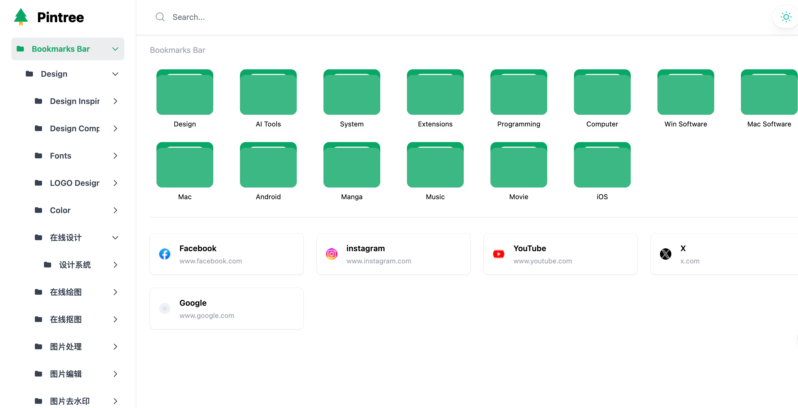
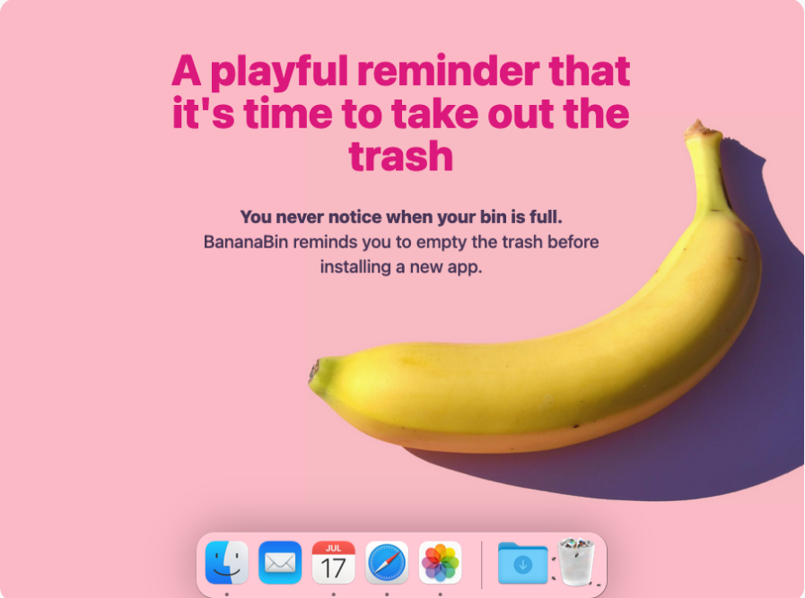
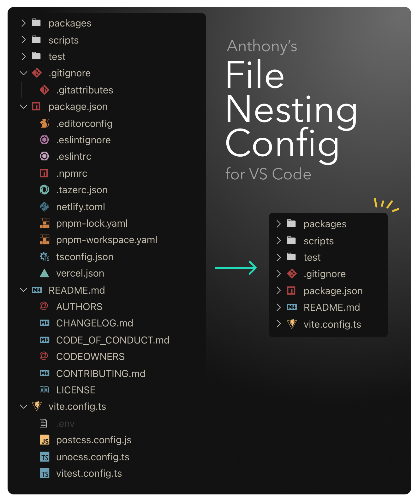
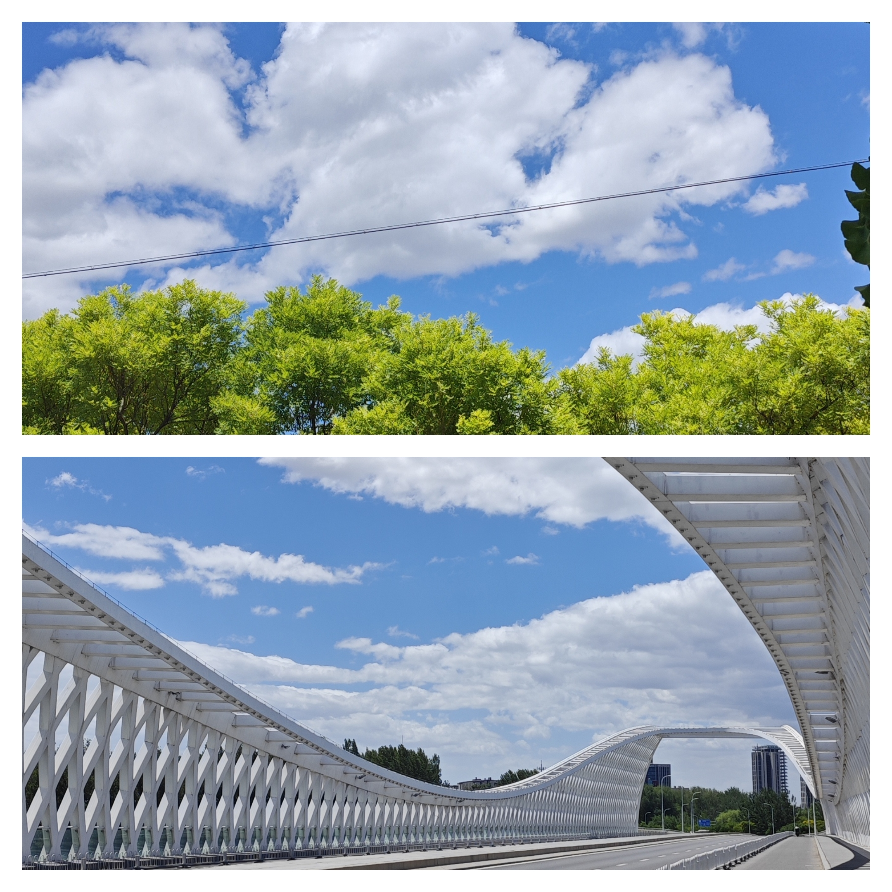

## 发现

### Pintree
Pintree (https://pintree.io/ ) 是一个开源的书签导航网站，可以把浏览器的书签转换成一个导航网站。 单纯从设计上看，绿色的风格给人一种眼前一亮的感觉，从产品角度看，无论是LandingPage还是书签站本身，在风格上都保持了一致性， 我觉得是值得借鉴的， 第一印象分高了不少。

有感而发，最近看了不少独立开发者的故事，很多开发者还是会保持较重的技术思维，忽略了产品本身的设计， 比如功能过度设计、产品UI不够新颖或者缺乏设计感、 产品入手复杂等等。 而好的产品往往都是给人眼前一亮的感觉，毕竟我们还是视觉动物，好看的东西大家大概率都会喜欢。

### BananaBin App
我觉得这个App有些许的恶趣味，但是确实蛮有意思的。 当你的MacOS垃圾桶满的时候，就会有几只小苍蝇爬来爬去了。把生活的东西具象化到屏幕交互元素上，值得玩一玩。  

这个思路和前段时间Stable Diffusion生成的毛绒图标在小红书爆火一样，长期以来我们交互的App的风格就像时尚一样，在扁平化设计和拟物化设计之间轮转。 但是之所以毛绒图标会火，更多是把生活中更容易接触到物品给具象化到屏幕上了，增加了亲切感和临场感。

### File Nesting Config 
一个VSCode配置，这个配置是将一些无关紧要的配置文件在平铺的时候保持嵌套不展示，避免各级文件夹展开后过于混乱。比如package.

这套配置规则还在不断更新,  目前也有对应的自动更新配置vscode扩展`File Nesting Updater`

### 其他几个开源项目
https://github.com/WerWolv/ImHex  一款开源的十六进制查看器，在设计上极具极客风，逆向工程师必备
https://github.com/CosmosShadow/gptpdf  一款可以将pdf转换为markdown格式的AI工具，使用OpenAPI接口的化大概每页0.013$

## 
## 热点
近期湖北电信、安徽电信对于Apple的`identity.ess.apple.com`屏蔽，导致苹果设备的互联互通、隔空投送、AppleTV屏幕镜像等功能生效。一开始是不断有人开始反馈这个问题，都以为是苹果的问题，直到大家发现反馈问题的网友的都集中在安徽和湖北，事情真相才开始浮现。运营商屏蔽一些重点网址已经屡见不鲜了， 目前应该都已经恢复。 

如果你也存在这个问题，不妨看看  https://github.com/ifr0zen/DoH-for-iMessage-FaceTime  这个项目， 安装一个描述文件来临时解决。当然，最好的解决方案就是“换宽带”

## 个人
这是上周末出去骑行拍的。 北京难得的好天气， 一天的微风，天空异常的干净通透， 心旷神怡。 随手拍了一些，就像画里一样。

第三期里提到我入手了一个mini主机，集成显卡的性能还算可以。 下载了刺客信条玩了玩，几分钟后却索然无味， 在电脑前楞了一会儿， 电脑没卡人却卡了。 
> 欲买桂花同载酒，终不似，少年游。

🏋️ 本周体重: <mark> 79kg </mark> 吃嗨了~