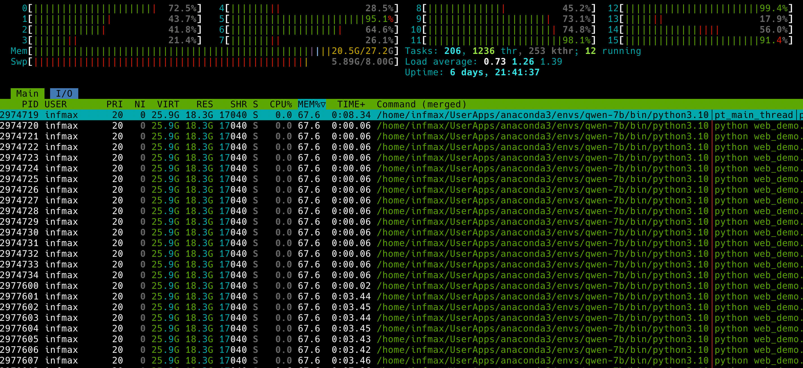

## 发现
本周主要分享几个效率类工具

### ray.so
https://ray.so 这个网站包含了多个有趣的工具。ray.so来自于raycast下的ray-so项目，目前也是开源的。 https://github.com/raycast/ray-so  。 额外补充一点， raycast是目前mac上新晋的一个全局搜索工具，类似系统自带spotlight或者前些年比较有名的alfred工具。  raycast的扩展插件挺丰富的，也推荐大家试一试。  

ray.so 主要功能包括： 
- 代码卡片， 支持数十种主题设置。
- Logo设计， 这个和我第4期提到的https://www.infmax.top/weekly/04/#%e5%8f%91%e7%8e%b0 shipfast工具基本类似。
- AI相关的Prompt\Preset 集合
- RayCast一些快捷的代码、主题配置等

### jsmind
`jsmind` 是一个开源的思维导图js类库。 你可以嵌入到自己的app中来提供思维导图的创建能力，当然也可以使用`jsmind.online`来做一些轻量的思维导图编辑；

### excalidraw

https://github.com/excalidraw/excalidraw 这个项目可以帮我们画出漂亮手绘风格的图标。 功能也比较丰富，比如无限画布、常见的形状、导入图片、导入`mermaid`格式的流程图等。可调整的选项单也相对简洁直观。托管版本支持多人协作等；

不过个人感觉和`draw.io`还是有一定的差距，draw.io中也有类似的草图风格。 支持的预设图标太少，不支持锚点的编辑等。不过做一些简单的流程图还是可以的。

## 自娱自乐
这周在自己的电脑上部署了一个`Qwen7B`的模型，纯CPU模式推理，能推但是推不动。8核16线程的cpu已经烧满，内存也占用了20G左右。 大概`0.25token/s`的速度，可以尝鲜玩玩，但是要用的话，还是建议上GPU吧或者直接购买商业服务吧。

我用的是AMD的8845hs处理器，支持npu。 但是AMD的RayzonAI目前的生态支持上还是缺不少，官方给的demo也只有寥寥几个模型, 如 https://community.amd.com/t5/ai/developer-blog-build-a-chatbot-with-ryzen-ai-processors/ba-p/680693 ， 也缺少 linux上的驱动。 如果你知道怎么发挥这块性能的话，欢迎留言交流。

目前AMD宣传的AI PC的东西我认为基本都是停留在概念阶段，实验室或者Demo的数据对于用户的体验也没啥提升。 当然，也能看到AMD在ROCm等方面的发力，但是想要追上CUDA阵营，还需要不少的时间。

## 流水帐
这个周六，和朋友一块骑行，来回60公里， 新的记录。 没事还是要出去溜达溜达，心情真的不一样。天气属实迷惑， 早上多云挺凉快，临时起意，就约上朋友来了一场没有目的地的骑行。 中午天上一片云都没有，快热化了。 躲到了一个小树林里。 下午返程的时候又是乌云密布，雷声四起， 俨然有一种黑云压城城欲摧的样子。 快到家的最后两分钟，暴雨直接来袭，哎，还是没躲开，淋了个落汤鸡。 但是却有一种难得的欢快和舒畅，雨中还大喊了几句，这种感觉很久都没有了。 

------

🏋️ 本周体重: <mark> 78.5kg </mark>