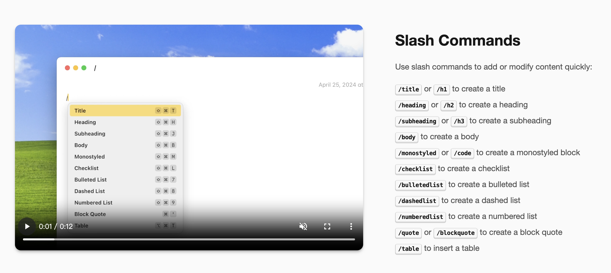

## 播客
本周在小宇宙听的这篇播客 [《同是天涯沦落人，当张爱龄遇上胡适之》](https://www.xiaoyuzhoufm.com/episode/6686496b0bc5d7cc70c2bc19)，印象很深刻， 对于张爱玲、胡适这些历史人物的生活有了具象的感知，历史也更加立体，不再只有对错。 

我最喜欢的播客频道是 [南海《轻阅读》](https://vscs.cri.cn/program/reading)，也分享给你。 这档播客是属于中国国际广播电台`南海之声` 下的一个栏目，每期都会播读一些散文、图书节选等，有时候也会邀请一些作家进行访谈。 比较经典的比如讲梅花《疏影横斜》，汪曾祺系列散文、中国书写的二十四节气系列等。 如果你喜欢文学作品的话，可以听一听， 主播周薇的声音我个人感觉特别的治愈，国家队的播音的水平还是挺高的。 这档播客也是我听的最久的，有七八年了，最早是在网易云上听的，后来电台调整就从网易下架了，主要在云听App 和 Apple播客 上播放。 现在的播客基本只能听到最近的100 期，早期的存档在蜻蜓FM上还可以找到。 

## 发现
本期给大家介绍几款Mac上的效率工具， `ProNotes`、`Notchnook`和 `Maccy`。其中 `ProNotes`和 `Maccy`我已经使用一段时间了，挺不错的。

#### ProNotes
[Pronotes](https://www.pronotes.app/) 是MacOS的note上一个扩展插件，将默认 Note 变成一个简易版的 Notion 笔记。 我个人平常对于自带的note使用频率还是比较高的，更多时候是当作一个随手的记事本来用， 所以平常也不会花费心思来整理格式，内容凌乱。 但是pronote这种可以快速调起格式调整，可以大大提高随笔的记录效率和记录的质量。 想想这本该是Apple做的事情~  

功能包括
- 方便的支持markdown的一些简易的格式， 比如标题、 列表等。
- 可以通过/ 的提示符号信息来进行不同的格式插入。 
- 双链笔记、笔记内搜索等

最特别注意的是，ProNotes还提供了AI的功能，比如内容总结、错误检查等，也可以自定义一些Prompt。 这也是Pronotes盈利的方式，目前只能通过订阅的方式来使用。 这块我觉得如果开发者可以提供自定义AI供应商的话，会更好一些。

#### Notchnook
[Notchnook](https://lo.cafe/notchnook) 让 mac也用上灵动岛。 macbook 系列后来加入的刘海我个人感觉是个设计上的败笔，长长的顶部边缘正中心挖了短短的一截，设计上显得特别不协调。 iPhone 上毕竟刘海和手机尺寸相比的话，整体还是相对协调的，同时将通知区域和控制区域分成了两侧。 包括后来的灵动岛我个人觉得是一个软硬件一体化设计的很好的范例， 当然网上也有人说是屎上雕花。

`Nochnook`可以通过这个刘海的区域，进行文件拖拽、媒体播放控制等，同样通过软件弥补了刘海的缺陷。 这是个付费工具，感兴趣的也可以试试～

#### Maccy
[Maccy](https://maccy.app/) 是 mac 上的剪贴板管理工具，这类工具其实很多，Maccy目标就是让我们可以快速访问到剪贴板历史，采用轻量化的设计理念。 实现快速访问，自然就是要减少操作步骤，Maccy 重要通过`快捷键的方式`来呼出和查找剪贴板历史， 避免鼠标点击操作。

 在AppStore 是付费的，你也可以从 Github 直接下载开源版本的来使用。 

## 见闻
我也来吐槽最近比较热门的食品安全问题，大家肯定也不陌生了，油管混装问题可能也只是冰山一角， 在食品化工的年代， 想要纯天然的饮食我觉得已经是奢望了， 天天都是在拆盲盒。 利益面前没有绝对的安全，什么声明啥的也都是利益方免责而已， 想要食品安全，那真要自己种，自己做。 

想想小时候在农村，辣椒、西红柿、豆角、茄子等好多都是自家地里种的，也特地不打农药的，整个夏天都是自给自足，甚至很多时候都吃不完，要说新鲜，那真的就是现摘现吃，没有更新鲜了。 有时候真的很想回到农村生活，贴近大自然，那才是不干不净，吃着没病的条件， 现在很多东西看着干净，实则...

## 个人

持续记录了几周的体重变化不大，看来只运动还是不够，本周开始控制饮食。 减肥还是遵循 `关注嘴迈开腿`  六字诀。
🏋️ 本周体重: <mark> 77.5kg </mark>

---