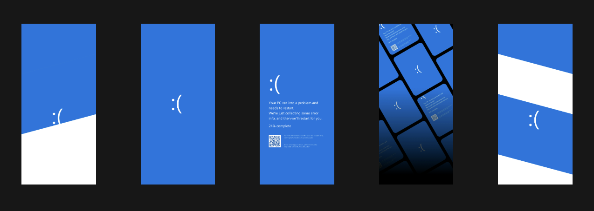
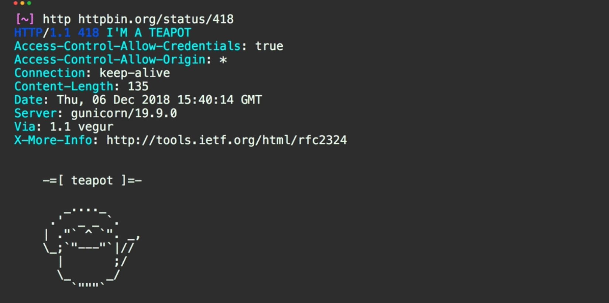
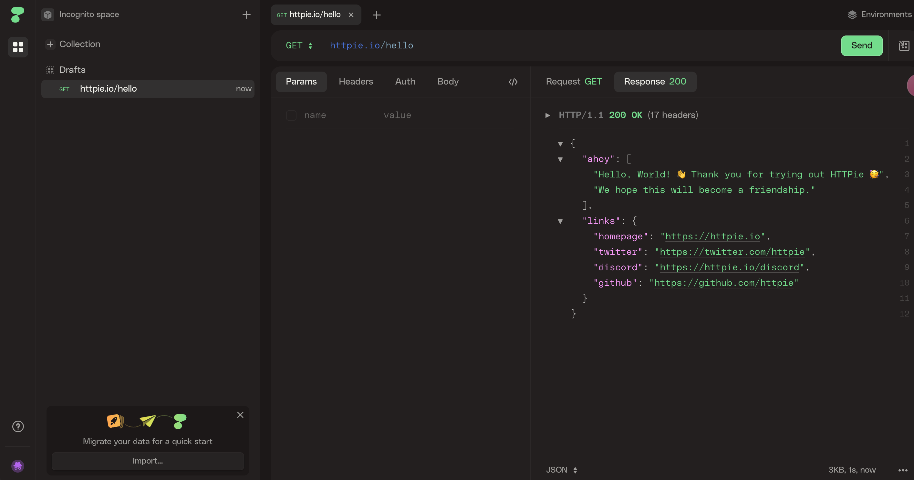
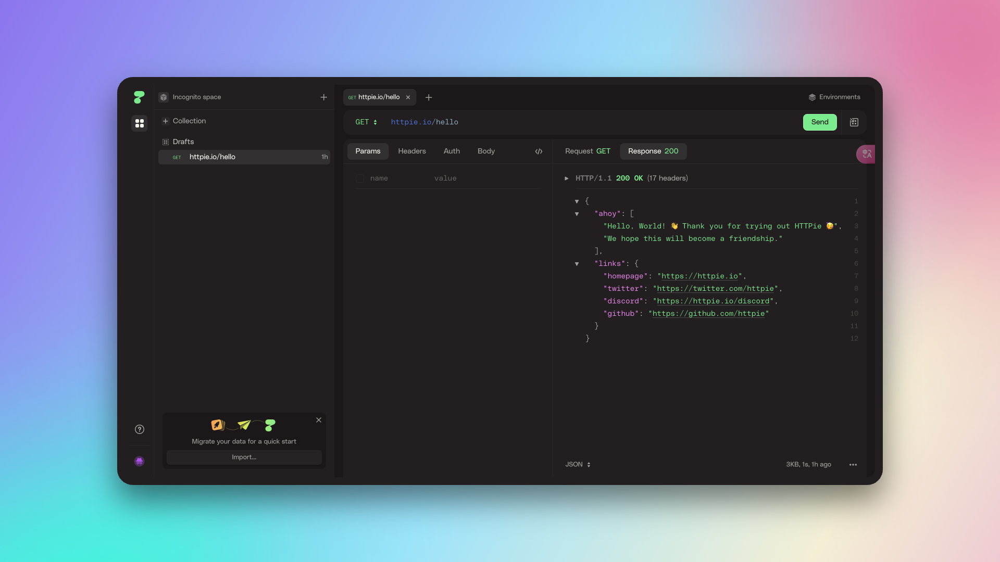
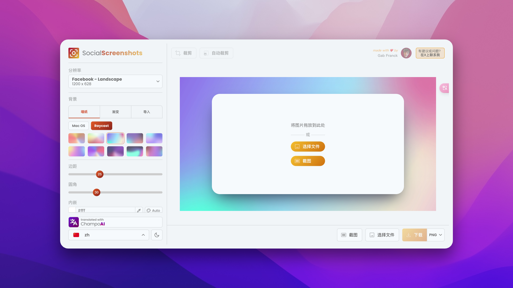
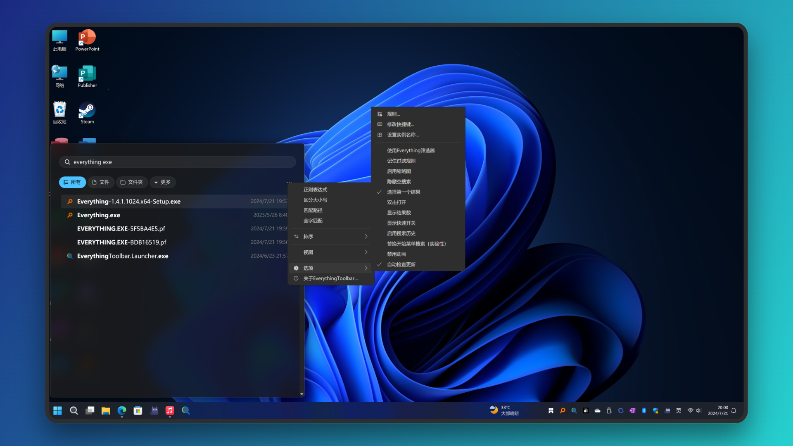

## 壁纸
这周科技圈的大事件，莫过于 windows 周五在全球范围内蓝屏了， 这是提醒打工人要提前下班了， 真是令人暖心啊。  实际原因是来自杀毒平台 CrowdStrike的更新引入了 bug 导致。当然，蓝屏这个现象大家也都开始各种调侃了，这里给大家奉上win11蓝屏限定壁纸， 图片来自 X 上某个博主分享的。 我自己又二创了几张，分享给大家。 原图太大有些影响网页排版，这里给是预览图。大家从链接下载吧。

<a href="./win11-blue-1.PNG" download>windows-blue-wallpaper-1.png</a>

<a href="./win11-blue-2.PNG" download>windows-blue-wallpaper-2.png</a>

<a href="./win11-blue-3.PNG" download>windows-blue-wallpaper-3.png</a>

<a href="./win11-blue-4.PNG" download>windows-blue-wallpaper-4.png</a>

<a href="./win11-blue-5.PNG" download>windows-blue-wallpaper-5.png</a>

## 发现
### httpie cli
[httpie/cli](https://github.com/httpie/cli) 是一个 cli 模式下的 API 调试工具,  输出结果也是格式化输出，并带有语法高亮显示， 相比于 curl 命令， httpie/cli 调试在交互上是非常友好的。它也是有[网页调试模式](https://httpie.io/app )，目前也支持 AI 模式的协作调试。

这个项目也是发生过一个非常令人伤心的事情，22 年的时候由于一次误操作，将仓库设置为了 Private，导致 Github 级联删除了该项目关联的所有社区的 Star和 Watch， 丢失了 54k 的 Star。

作者对着这个操作也很迷惑，自己明明不会主动将仓库设置为 Private，后续分析原因应该是自己将个人账户jkbrzt/jkbrzt 设置了 Private，按照 Github 的管理模型，项目发起人和关联组织应该是同样的实体权限， 所以导致了 httpie 也被设置为 Private 了。


官方还特地记录下这次事故 https://httpie.io/blog/stardust ，有兴趣可以看看。  如果后期自己也有在 Github 管理项目或者组织，一定要小心哦！


### grep.app
[grep.app](http://grep.app) 是一个 github 项目的检索站，可以通过关键字或者正则表达式进行检索。我自己试了下，相比于 github 本身，检索的要快不少， 检索结果也是最终链向 github。 如果平常有搜索项目或者代码段的需求的话，不妨试试。

### socialscreenshots
[socialscreenshots](https://socialscreenshots.com/editor) 是一个截图分享工具，可以方便的将网页截图制作为一个带渐变背景风格的图片，突出分享的内容。 支持 X, Facebook 等不同社交媒体的尺寸预设，支持 MacOS/RayCast 风格的背景设定。 上面 [grep.app]() 截图以及下面该工具的预览图就是用socialscreenshots制作的。 

更方便的是，除了导入已有的图片，该工具点击截图 可以直接在浏览器中自动截取我们选择的 浏览器Tab页面来分享。 

### EverythingToolbar
[EverythingToolBar](https://github.com/srwi/EverythingToolbar) 是windows上everything搜索工具的一个集成扩展， 所以你也需要先安装好Everything。它将Everything放置在windows状态栏，替代原有的windows搜索功能。同时还无缝和QuickLook预览工具协作。

顺带说下，[QuickLook](https://github.com/QL-Win/QuickLook?tab=readme-ov-file) 是Windows下一个Space键文件预览工具，Mac用户对这个功能应该都不陌生了，还是很方便的。

## 个人
本周在家里搞了一次大扫除，进行一次断舍离。 好多东西原来留着都是想着还有些用，到现在都积上了厚厚的一层灰，也没用到。 搞了整整一天，竟然清理出5大包一直没用的物件， 看着屋里整洁了许多， 心情也舒畅了许多。 
嘿但话说回来，有时候就这么有趣，用的时候还真没有～

---
🏋️ 本周体重: <mark> 77.5kg </mark>