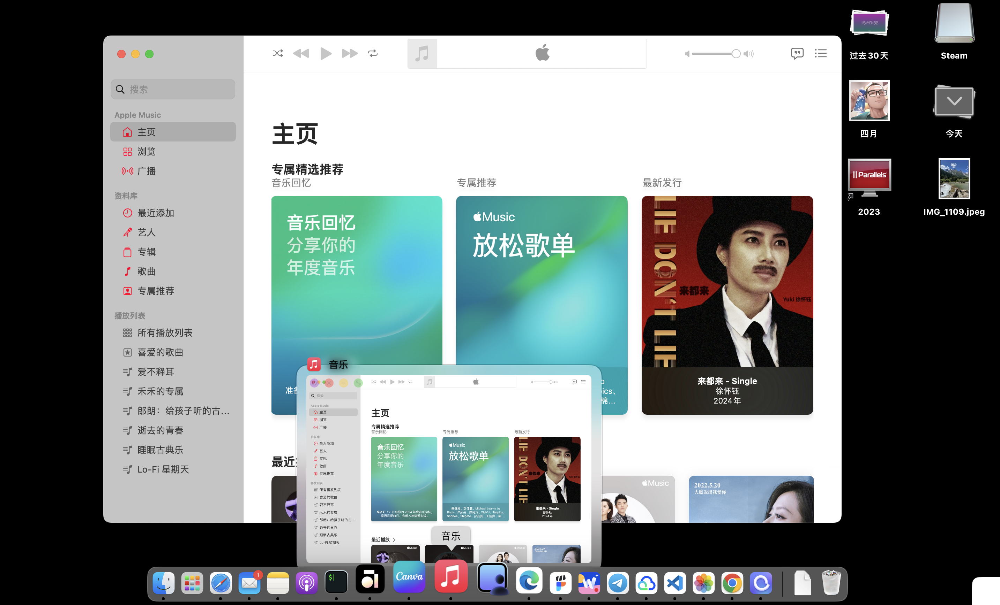
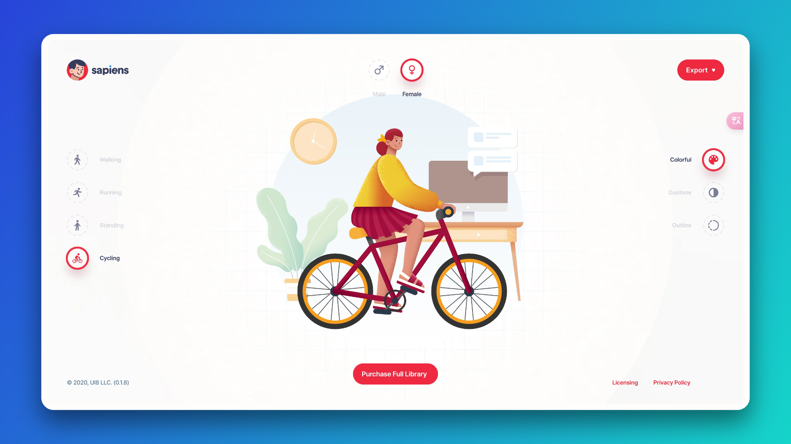
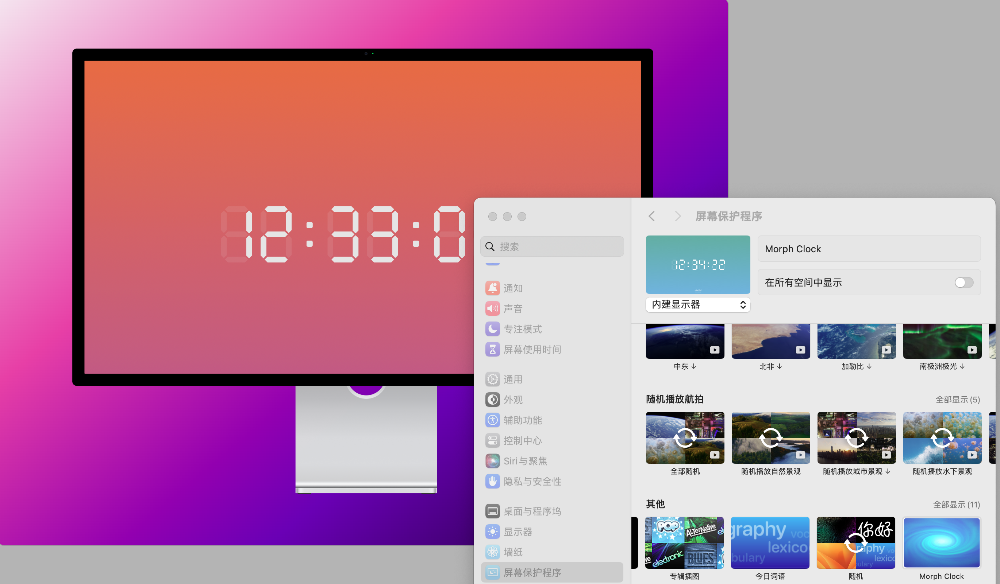

没想到，鸽了小半年了， 时间过得怎么这么快。 7月底去了趟川西，稍作放松之后，就进入了紧张的工作中，一直没精力来写周刊了，没想到一直转眼都 12 月份了，中间其实断断续续积累了不少想和大家分享的。 封面图是川西游玩的随手拍的自然风光。


## 发现
### dockerdoor
macOS上的 docker窗口预览工具，和 windows 上的窗口预览功能差不多。 不过这个工具在窗口最小化之后，也无法预览，只能是窗口堆叠的时候，可以预览一些窗口，聊胜于无吧，感兴趣的可以试试。



### sapiens插画
https://sapiens.ui8.net 这是一个可以自定义的插画组合工具，像我这种又想搞点儿文艺风，又手笨的，可以简单点点就可以做出一个像样的插画故事，挺好玩儿的。



### Morph Clock屏保
另外，发现了一个独立开发者的小作品，[莫负时钟屏保](https://chuquan.me/2024/01/18/my-indie-hacker-products/#more), 我已经用了一两个月了，简洁大方的设计，而且背景动态渐变，又不失灵动，个人觉得是非常好的一个作品。



## 个人
朋友提到我这网站的https访问异常了，调查一番后发现是 gitpages 的 https 证书过期了3个月无法自动证书续期。原因是之前套了 cloudflare CDN加速，由于解析 xxx.github.io 的域名解析不再是 github 的几个特定的IP 中(下方), 而是导向到了 cloudflare 的服务器，导致了github无法自动生成新证书。 

目前改为仅在cloudflare使用cname解析，但不开启cloudflare代理， 然后在gitpages设置中重新绑定域名，触发证书生成，几番折腾，回到原点😊。 有类似问题的伙伴按上述关键字查找，网上解决方案挺多的。

```
185.199.108.153
185.199.109.153
185.199.110.153
185.199.111.153
```

最近在腾讯云上又续费了一个轻量主机，之前都是自建了一些服务，比如笔记、书签等。但是之前备案已经过期，无法继续通过域名访问了，几番搜查，再次祭出了 CloudFlare 这个赛博活佛，通过Tunnel给自建服务套了一个https免备案访问，操作也挺简单的。 


这里我搭建了一个 [IT Tools](https://github.com/CorentinTh/it-tools) 项目的工具站，我放到了博客右上方菜单页[IT 工具集](https://tool.infmax.top), 觉得有用可以收藏了😄。


---
🏋️ 本周体重: <mark> 79.5kg </mark>， 肥了😭