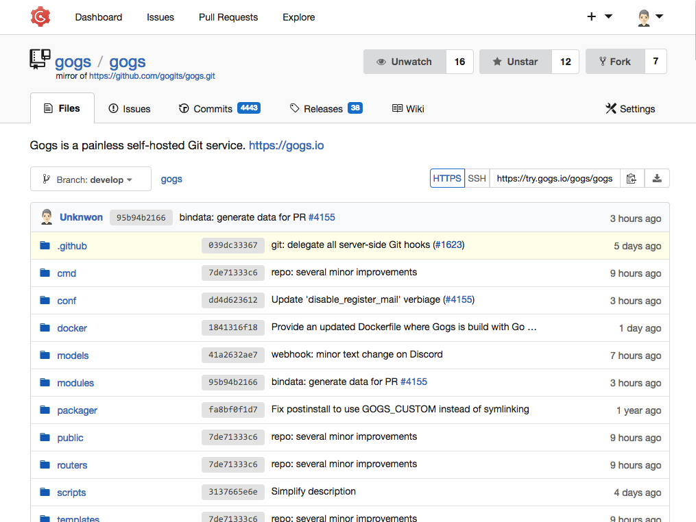
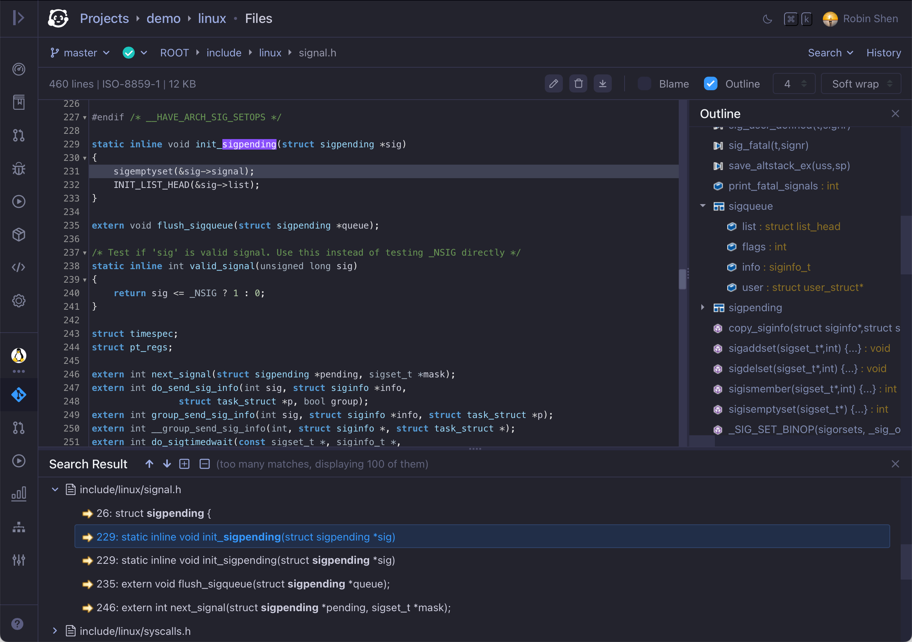
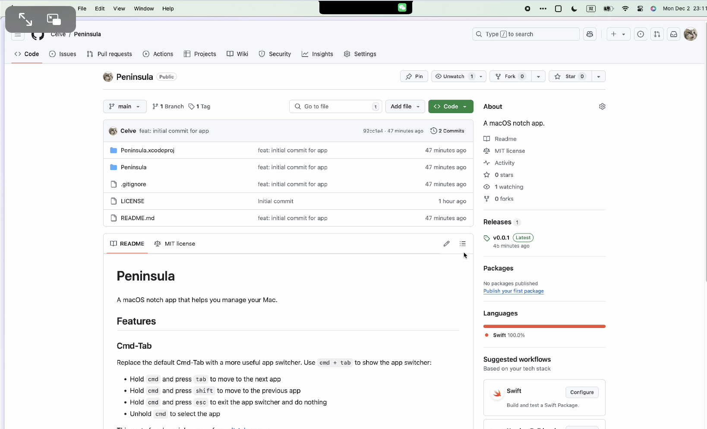

最近工作上能稍微松弛一些，继续保持更新。 北方的冬天是真的冷，就感觉地球走到了一个点突然转过去了，最近已经没有出门遛弯儿的欲望😄。 封面图是今年8月份去秦皇岛时拍摄的。

## 书籍
这周把贾平凹的《废都》看完了，尺度之大，感叹作家是真敢写，简直是当代版的金瓶梅。 不过前期越是写的激荡，角色之间的情感关联越是激荡，后期转入低谷期就有多悲剧，知乎上和微信读书上有较多的讨论，感兴趣可以搜一搜。 说起这，近两年对陕西的几位作家的作品比较感兴趣，其中陈彦的三部曲我个人比较推荐，比如《装台》前几年张嘉译闫妮拍过电视剧，《主角》获得茅盾文学奖，还有《喜剧》， 这几部分别围绕着戏曲的台前、幕后关联的不同人物的生活展开， 有主角的波澜起伏的生活，也有装台小人物的不易。

## 发现
### 自建Git代码托管服务
最近 GitLab极狐的向CE版本免费用户发函要求购买授权，被技术员工声讨帖子中称为《绝户网计划》， 详细可以看看https://36kr.com/p/3074244292489858。 Gitlab在中小企业中应用的还挺广泛的。不过，如果仅仅只是简单的代码托管，团队规模不大的话，其实没必要选择这么重的服务。这里给大家分享两个轻量级的 Git代码托管服务。 

一个是[Gogs](http://gogs.io)， 用 golang 实现的，轻量易用， UI 方面和 Github 比较相似，入手可能会更快一些。 支持 Docker 等方式部署，也支持多用户管理、支持定期同步外部仓库。 这个我自己用的比较多， 但是有一个缺点就是同步 Github 外部仓库的时候，由于国内网络原因经常会失败，但是重试的时候由于残留数据，无法重新生成同步任务，需要手动清理。除此之外，都挺好的。

另外一个 Onedev， 这个项目更多侧重于 CI/CD 管理，集成了代码托管、自动构建、看板等功能， 方便团队协作。 这个项目也是最近才了解到，还在摸索中。

### Peninsula mac刘海屏应用

在第7期中分享过一个收费版的[Notchnook](../07/index.zh-cn.md#notchnook)。 这Peninsula这个开源项目也是利用了刘海区域， 支持应用通知，还有应用切换功能。

## 个人
刚用心爱的邮箱关联注册了X账号，中途换了个手机登录，第二天被封，申诉一周没消息看似无望。

---
🏋️ 本周体重: <mark> 79.0kg </mark>